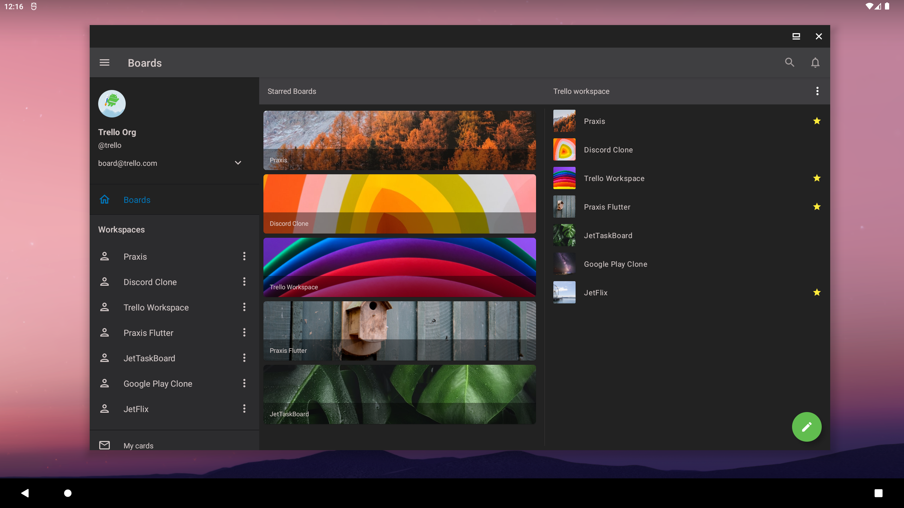
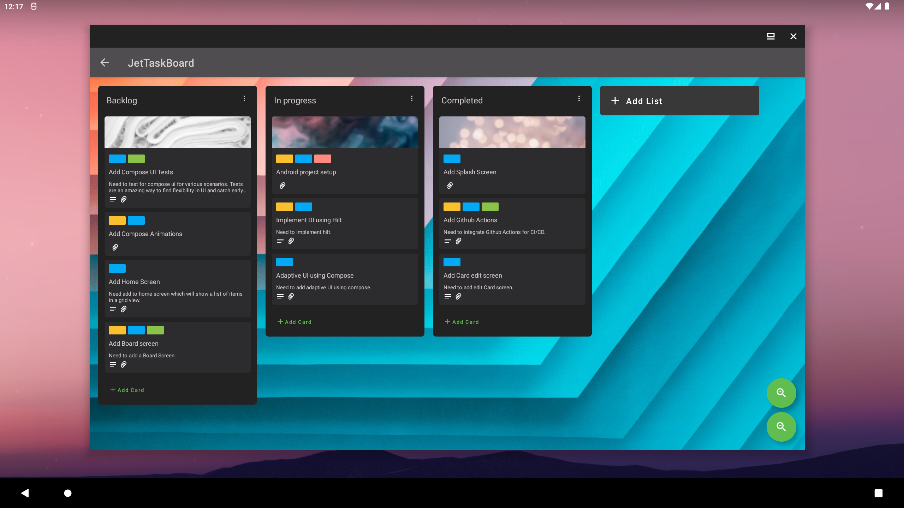
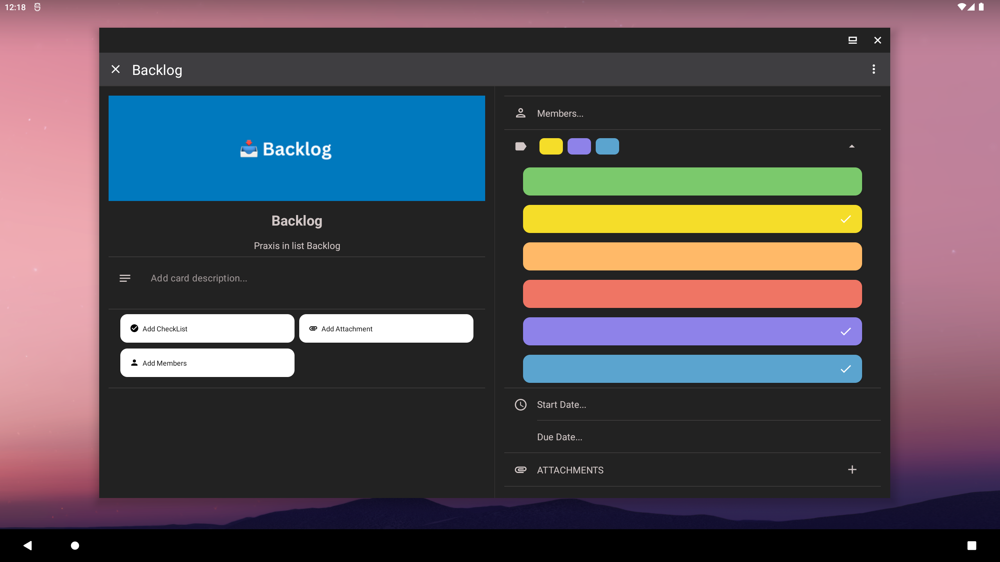
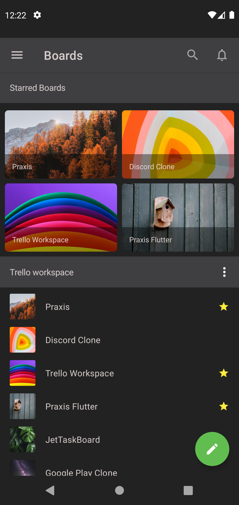
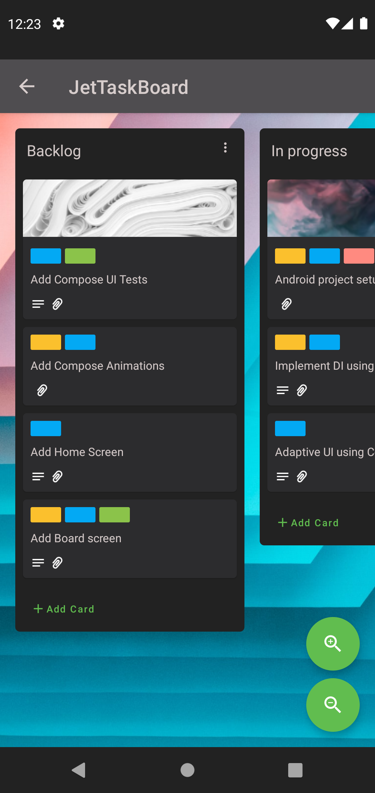
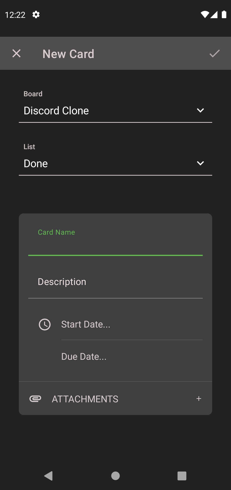
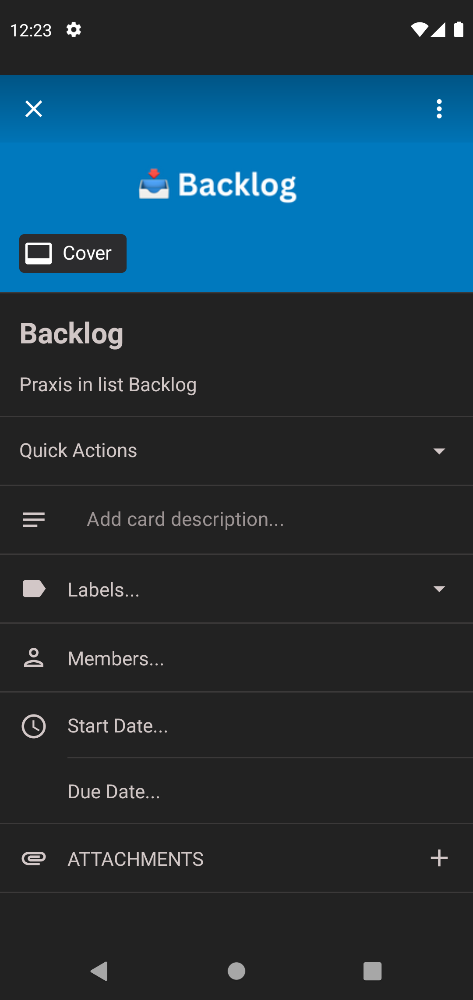

This repository is no longer maintained and has been migrated to Compose Multiplatform: [JetTaskBoardKMP](https://github.com/pushpalroy/JetTaskBoardKMP).
All new updates and improvements are done in the JetTaskBoardKMP repo.


<div id="top"></div>

## 📋 JetTaskBoard - Android Trello clone

  <p align="left"> A clone of Android Trello app with adaptive UI built using Jetpack compose. The application is responsive to adapt to a wide range of screen sizes. The demo is shown on a 13.5" inch Freeform emulator.</p>

  <p align="left">
      <a href = "https://developer.android.com/jetpack/androidx/versions/all-channel#february_23_2022">
        
      </a>
      <a href="https://kotlinlang.org/docs/releases.html">
        
      </a>
      <a href = "https://github.com/pushpalroy/jetTaskBoard/stargazers">
        
      </a>
      <a href = "https://github.com/pushpalroy/jetTaskBoard/network/members">
          
      </a>
      <a href = "https://github.com/pushpalroy/jetTaskBoard/watchers">
          
      </a>
      <a href = "https://github.com/pushpalroy/jetTaskBoard/issues">
          
      </a>
  </p>

### Board with drag and drop

<video src="https://user-images.githubusercontent.com/19844292/195022680-f15e907d-0e55-4d22-8bcc-bfdbb6a5ef83.mp4"></video>

### Adaptive screens

<video src="https://user-images.githubusercontent.com/19844292/195041698-7384a20c-85df-4ee2-9d82-ad57d8fab8d2.mp4"></video>

### 👨‍💻 Tech stack

| Tools                      |                                                                       Link                                                                        |
|:---------------------------|:-------------------------------------------------------------------------------------------------------------------------------------------------:|
| 🤖 Kotlin                  |                                                         [Kotlin](https://kotlinlang.org)                                                          |
| 💚 Jetpack Compose         |                                         [Jetpack Compose](https://developer.android.com/jetpack/compose)                                          |
| 🏛 Architecture Components |                           [Android Architecture Components](https://developer.android.com/topic/libraries/architecture)                           |
| 💉 Dagger Hilt             |                              [Dagger Hilt](https://developer.android.com/training/dependency-injection/hilt-android)                              |
| 🌐 Material Design         |                            [Material Design](https://developer.android.com/jetpack/androidx/releases/compose-material)                            |
| 🌊 Coroutines              |                                       [Kotlin Coroutines](https://developer.android.com/kotlin/coroutines)                                        |
| 🪟 Window size classes     | [Support for different screen sizes](https://developer.android.com/guide/topics/large-screens/support-different-screen-sizes#window_size_classes) |

### ⚒️ Architecture

JetTaskBoard follows the principles of Clean Architecture with Android Architecture Components.

<p align="right">[<a href="#top">Back to top</a>]</p>

### 🖥️  Screenshots (Tablet)

<table style="width:100%">
  <tr>
    <th>Home</th>
    <th>Board</th> 
    <th>Create Board</th>
    <th>Edit Card</th>
  </tr>
  <tr>
    <td></td> 
    <td></td>
    <td></td> 
    <td></td>
  </tr>
</table>

### 📱 Screenshots (Phone)

<table style="width:100%">
  <tr>
    <th>Home</th>
    <th>Board</th> 
    <th>Create Board</th>
    <th>Edit Card</th>
  </tr>
  <tr>
    <td></td> 
    <td></td>
    <td></td> 
    <td></td>
  </tr>
</table>

### Status: 👩‍💻 In progress

  <p>JetTaskBoard is under active development.</p>

<p align="right">[<a href="#top">Back to top</a>]</p>

### 🧲 App module graph


### ✅ Lint

This project uses [ktlint](https://github.com/jlleitschuh/ktlint-gradle)


### 💬 Want to discuss?

Have any questions, doubts or want to present your opinions, views? You're always welcome. You can [start discussions](https://github.com/pushpalroy/jetTaskBoard/discussions).

### 🤝 Contributors

See our rockstar contributors :smile:

[](https://github.com/pushpalroy/jetTaskBoard/graphs/contributors)

### Find this project useful ? ❤️

- Support it by clicking the ⭐️ button on the upper right of this page. ✌️

### License
```
MIT License

Copyright (c) 2022 Pushpal Roy

Permission is hereby granted, free of charge, to any person obtaining a copy of this software and associated 
documentation files (the "Software"), to deal in the Software without restriction, including without limitation 
the rights to use, copy, modify, merge, publish, distribute, sublicense, and/or sell copies of the Software, and 
to permit persons to whom the Software is furnished to do so, subject to the following conditions:

The above copyright notice and this permission notice shall be included in all copies or substantial 
portions of the Software.

THE SOFTWARE IS PROVIDED "AS IS", WITHOUT WARRANTY OF ANY KIND, EXPRESS OR IMPLIED, INCLUDING BUT NOT LIMITED TO 
THE WARRANTIES OF MERCHANTABILITY, FITNESS FOR A PARTICULAR PURPOSE AND NONINFRINGEMENT. IN NO EVENT SHALL THE 
AUTHORS OR COPYRIGHT HOLDERS BE LIABLE FOR ANY CLAIM, DAMAGES OR OTHER LIABILITY, WHETHER IN AN ACTION OF CONTRACT, 
TORT OR OTHERWISE, ARISING FROM, OUT OF OR IN CONNECTION WITH THE SOFTWARE OR THE USE OR OTHER DEALINGS IN THE SOFTWARE.
```
